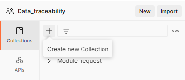
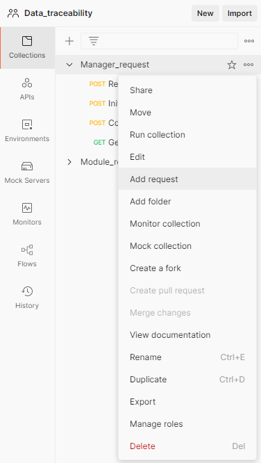
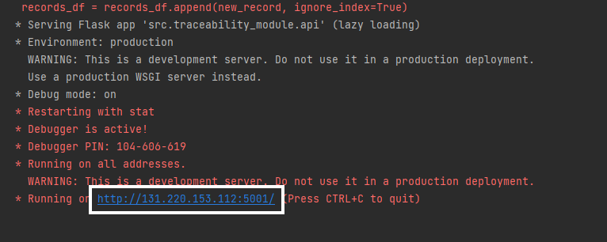
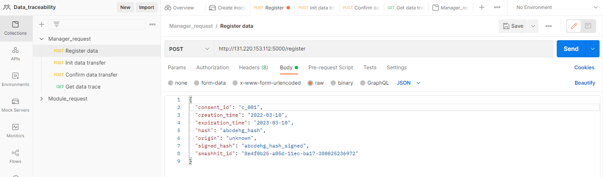

# Project: smashHit 
  Solving Consumer Consent & Data Security for Connected Car and Smart City

## Contributors

Developed By: University of Bonn (UBO) and Leibniz Universität Hannover (LUH)  
Consortium Partners: Institute for Applied Systems Technology Bremen (ATB), Leopold-Franzens-Universität Innsbruck (UIBK), Atos Information Technology (ATOS), InfoTripla OY (INFT), The open group limited (TOG), Forum virium Helsinki OY (FVH), Volkswagen AG (VW), LexisNexis Risk Solutions (LN)

## SmashHit Data Use Traceability Implementation Overview

The Data Use Traceability is the part of the smashHit platform which enables the tracking of data packages within the smashHit system, as well as the re-identification of leaked data. These two main goals resemble the two components: **Traceability** component and **Re-identification** component.

## I. Traceability Component

The goal of the traceability component is to enable the data owner or data provider to track the usage of its data within the smashHit platform. This is done using two main packages which are _traceability manager_ and _traceability module_

### Usage of the repository after cloning and installation of packages:
1) The data traceability project has two major components, Traceability Manager and Traceability Module. This repository contains both in separate folders. 

2) This Traceability Module communicates with Traceability Manager to handle the user requests. A local run and communication can be established by running the <b> main.py </b> of 
   both i.e. of manager and of module. Upon run, the manager runs on http://localhost:5000/swagger-ui/ and the module runs on http://localhost:5001/swagger-ui/ . 
   Using the module from browser, http://localhost:5001/swagger-ui/ different functionalities can be used to communicate with the manager. 
   When the manager is being run on separate server, the address of the server needs to be passed in main.py of the traceability_module's url_to_manager field for the communication.
   e.g. for Manager running on Hannover server, url_to_manager = 'http://smashhit.l3s.uni-hannover.de' needs to be uncommented in util.py and for Manager running on smashHit server 
   url_to_manager = 'https://smashhit.ari-mobility.eu/api/traceability' needs to be uncommented keeping other 2 commented.

3) Inside main.py of the module, the smashhit_name default 'LUH_UBO_Sender' or 'LUH_UBO_Receiver' defines whether this module is used by the data sender company or the data receiving company. Thus,
   if the module is being run by the company which is registering the data, or initiating the transfer of the data, for it, the default value of smashhit_name parameter should be 
   'UBO_sender' and for the company confirming the data transfer receipt, the default value should be set as 'UBO_receiver' before running the module's main.py. For testing purpose, respective value 
   can be set just in one company module and still the functionalities will work. Inside the main of the manager, the default value of the smashhit_name is set as 'manager' defined inside 
   util.py of the utils and this should not be changed. When the manager and module will be run in real world application, each company using the module will have its own unique smashhit name 
   in place of 'LUH_UBO_Sender' or 'LUH_UBO_Receiver'. For example, if ATOS is using it, its smashhit name should be given as ATOS and this should always be used in future as during 1st time use, 
   private and public keys are created for each company and give and take happens with the deployed manager.

4) To get started, clone this repository or extract files from the zip which will have same hierarchy as in this repository. <b> The inputs and outputs 
   of the functionalities can be sequentially seen in the screenshots 1_ to 5_ placed inside the images folder. </b>  
   During Initiate Data Transfer, Receiver company's name registered with smashhit should be passed as value to the field receiver_name.  
   During Confirm Data Transfer, Sender's id as received in response of Initiate Data Transfer should be passed as value to the field sender_id.

5) While confirming the data transfer by the receiving company( after setting smashhit_name='receiver' in main.py of traceability_module and re-running its main.py), 
   signature_of_sender from the UI should be set as what was received in response at UI during Initiate Data Transfer functionality. 

### 1. Traceability Manager Package

It includes two main classes (TraceabilityManager, DataProcessingLogs) and it is the central part connecting all the other actors in the process of data sharing.

#### a) Traceability Manager Class

This class implements the main functionalities of Data Use Traceability.

###### i. Register Data 

Each data, to be registered, has an owner that makes the data available to other actors. Each actor present in the system has an _id_, a _public key_, a _private key_.  Each generated data to be stored requires different attributes, which are: 
* __consent id__: identifier of the consent given by the data owner, to save and exchange the data.
* __contract id__: identifier of the contract given by the data owner, to save and exchange the data.
* __creation time__: time at which the company receiving the information from the owner, collected that data.
* __expiration time__: time up to which all the companies in possession of that data are allowed to use it, as defined by contract with the data owner.
* __hash data (and metadata)__: hash of the data content and metadata 
* __fingerprint__: fingerprint of the data being sent to a receiver
* __origin__: id of the data owner
* __smashhit id__: INTERNAL in code, public id of the company receiving directly the data from the data owner.
* __signed hash__: INTERNAL in code, the signature of the hash data, using the private key of the data owner

###### ii. Notify Data Transfer

A company A that would like to send data to company B should inform the Traceability manager. The manager performs some controls on the data and if everything is correct, authorizes the transfer of that data by recording the first part of the information for this transfer which consists in:
* __uniform resource identifier__: id of the data created during the registration process
* __receiver id__: id of the company B to which the data should be sent
* __sender id__: INTERNAL in code, it is the id of the company A, that wants to send the data
* __signature of sender__: INTERNAL in code, it is the signature of the <hash data (and metadata)> present in the registered data, using the private key of the sender

###### iii. Verify Received data

After the notification sent by company A to inform the manager that it is about to send some data to company B, the manager receives a notification from company B saying that the data has been received correctly. Again, the manager should make some checks before storing the last part of the information for this transfer, which is:
* __signature of receiver__: signature of a data tuple (data identifier, sender id, receiver id, signature of sender, <hash data (and metadata)>) using the private key of the receiver. 
* __confirm_date_time__: date time of the confirmation of data receipt by the company B
  
This last part is then added to the record previously created with the first part of transfer data. 

###### iv. Get Data Trace

The data owner should be able, based on the consent given (consent id) or on the contract given (contract id), to get a list of all the companies with which the data has been shared. The objective is to give the possibility to the owner to check that the use of the data is done accordingly to the consent.

#### b) Data Processing Logs Class

This class is in charge of interacting directly with the database. The database stores registered data, and the log of data transfers between companies.

###### i. Register Data

This function receives, from the traceability manager, the list of parameters about the data. It creates a __*uniform resource identifier*__ for that data and stores all the parameters as one record of the registered data. The received parameters are:
* __smashhit id__: public id of the company receiving directly the data from the data owner.
* __hash data (and metadata)__: the hash data content and metadata 
* __signed hash__: the signature of the hash data, using the private key of the data owner
* __consent id__: identifier of the consent given by the data owner, to save and exchange the data.
* __contract id__: identifier of the contract given by the data owner, to save and exchange the data.
* __fingerprint__: fingerprint of the data being sent to a receiver
* __origin__: id of the data owner
* __creation time__: time at which to company receiving the data from the owner, collected that data.
* __expiration time__: time up to which all the companies in possession of that data are allowed to use it, as defined by contract with the data owner.

###### ii. Log Data transfer

It distinguishes two cases, the first case is when the Traceability Manager receives the notification for data transfer and forwards to the Data Processing Logs the first list of parameters to store. In this case, there is no __*signature of receiver*__ in the list of parameters. Since __signature of receiver__ is part of the structure for data transfers, its value is set to None by default. Then, Data Processing Logs stores all the received parameters in the list of transferred data.

The second case is when Traceability Manager receives the confirmation from a company that the data has been received. In this case, the list of parameters contains the __*signature of receiver*__. Data Processing Logs searches inside the list of transferred data, the record with the same values for all the parameters different from __signature of receiver__. Then, for this record, the value of __signature of receiver__ is substituted with the one in the corresponding received parameter.

The list of parameters constituting a data transfer is:
* __uniform resource identifier__: identifier of the data created during the registration phase
* __sender id__: smashhit id of the company sending the data
* __receiver id__: smashhit id of the company receiving the data
* __signature of sender__: signature of the <hash data (and metadata)> present in the registered data, using the private key of the sender
* __signature of receiver__: signature of a data tuple (data identifier, sender id, receiver id, signature of sender, <hash data (and metadata)>) using the private key of the receiver.

###### iii. Get Consent Data trace

Given a __consent id__ which identifies data from the owner, this function returns the list of data transfers involving the data corresponding to that consent id. 

###### iii. Get Contract Data trace

Given a __contract id__ which unambiguously identifies data from the owner, this function returns the list of data transfers involving the data corresponding to that contract id. 

###### v. Get Data Id

Given hash data, this function returns the uniform resource identifier for the corresponding registered data.

### 2. Traceability Module Package

This package is about the single companies interface on the smashhit platform. The companies exchange clear data outside smashhit, but they should report in the platform each operation performed outside, using the APIs offered by smashit platform.

There is no mechanism to enforce companies' report, but since they would like to trace their data as well as data owner, they have to follow the guidelines of Data Use Traceability during a data transfer process. 

#### a) Traceability Module Class

It defines the main attributes of a company within the smashhit platform, which are:
* private key
* public key
* public identifier

The __private key__ is used for digital signature of data.

###### i. Register Data

The company using this function is either the owner of the data, or the company to which the data owner gave its consent. In case the company is the data owner, there should be a default consent. The company signs the hash of data with metadata and inserts the signature in the list of parameters that will constitute the data record. When the company activates this function, it has to provide:
* __access_token__: The x-auth-token used for Authorization in smashHit platform valid for 1 hour of the session
* __consent id__: identifier of the consent given by the data owner, to save and exchange the data.
* __hash data__: hash of the pure information without any metadata
* __fingerprint__: fingerprint of the data being sent to a receiver
* __origin__: id of the data owner
* __creation time__: time at which the company receiving the information from the owner, collected that data.
* __expiration time__:  time up to which all the companies in possession of that data are allowed to use it, as defined by contract with the data owner.

###### ii. Notify Data Transfer

The guidelines of the smashhit platform concerning Data Use traceability specify that the transfer of data from company A to company B should be reported on the platform. This function is the one allowing this report and is only triggered during the data sending process. 

The company notifies the manager about the data it would like to send and inserts the receiver of the data and its own signature of the data. To trigger the function, the company needs:
* __access_token__: The x-auth-token used for Authorization in smashHit platform valid for 1 hour of the session
* _unified resource identifier_ of the data, created by the manager during the registration process. The company has it stored internally because when it asks for the registration of new data, the manager returns the data id to the company. When instead, it receives data from another company, that company inserts the data id inside the report.
* _receiver id_ available since it is public information.

###### iii. Verify Received Data

After receiving the effective data from another company, the company receives a report containing additional information about the data transfer. This function is only triggered in this situation, by the report, and the company receiving the data internally stores some key information, signs the hash of data with metadata together with data id, sender id, own smashhit id, and signature of the sender. 

After that, it notifies the manager that the data have been correctly received by sending the required parameters. The parameters of this function are:
* __access_token__: The x-auth-token used for Authorization in smashHit platform valid for 1 hour of the session
* __hash data with metadata__: created during the data registration phase and stored in the data record
* __uniform resource identifier__: the data id created by the manager during the registration phase.
* __sender id__: public identifier of the company sending the data.
* __signature of sender__: signature of hash based on data id, sender id, receiver id, and using the sender private key.

###### iv. Get Data Trace

The company uses this function to request the trace of its own registered data, meaning the data not received from another companies but either owned by the company or directly collected from the data owner.

###### v. Re-identification Component
W_Trace: To use the W-Trace component to watermark trajectory(latitude-longitude pairs) data that needs to be safely sent from one organisation to another without any data leakage. 

Model Run: The traceability module once run on the client side(e.g. http://localhost:5001/swagger-ui/), gives access to the APIs for watermarking under the "Reidentification" header with name as "watermark_trip". 

Input and Watermarking: The input to watermarking should be a trip data(json) which has a sequence of latitude and longitude pairs(as in the sample file provided by Volkswagen). Upon execution, the response 
from the API will then be the watermarked trip in json format that is same as the input data format with a difference that the original latitude-longitude pairs have been replaced by watermarked latitude-longitude pairs.
The average deviation of original trajectory latitude-longitude pairs from the newly generated watermarked latitude-longitude pairs is always less than 10 metres.

Another alternative for watermarking is to place the input json trip file in the folder “data_use_traceability/src/traceability_module/wtrace_data/input_files/" and then the standalone run of python script  
- “data_use_traceability/src/traceability_module/check_watermark_correlation.py” watermarks the input trip file and outputs the watermarked trajectory in same format as is the input trip file. For this standalone run, 
 the trip file name(without extension of ".json" should be given during execution in the format <i> python3 src/traceability_module/watermark_trip.py --trip_file <name_of_trip_file> </i>. 
Before this, its important to set the working directory as "data_use_traceability".

Output & Intermediate Files: For each trip's watermarking, its respective output file is always saved in the “wtrace_data/output_files/” folder with the name “output_of<input_trip_file_name>”
Other intermediate files, e.g. watermark file which is used to inject the input trip file with the watermark is saved in the “data_use_traceability/src/traceability_module/wtrace_data/intermediate_files/” folder with name “<input_trip_file_name>_watermark.npy”. 
This secret file is used for watermarking and also during computation of correlation of this watermark with the watermark that is extracted at point of time from the watermarked data(with/without intruder’s attack).

Checking Watermarking Correlation:The traceability module once run on the client side then gives access to the APIs for checking the correlation under the "Reidentification" header with name as "watermarked_correlation". 
The input to this API should be again a trip data(json) in similar format as was given for watermarking with the difference that this time the trajectory's lat-long pairs are watermarked. Upon executing the API, 
the response is the correlation value which is between the original watermark and the watermark that is extracted from the watermarked data(with/without intruder’s attack). 

Alternatively, a standalone run of the python script - “data_use_traceability/src/traceability_module/check_watermark_correlation.py” can also be used to check the correlation of the watermark extracted 
from the watermarked trajectory at any point of time with respect to the original watermark file used for watermarking. Input to this should be a watermarked trip file named as "output_of_<trip_id>.json" and be placed under the 
“data_use_traceability/src/traceability_module/wtrace_data/output_files" folder. For this standalone run,  the trip file name(without extension of ".json" should be given during execution in the format 
<i> python3 src/traceability_module/watermark_trip.py --trip_file <name_of_trip_file> </i>.  The correlation score which is received as response, when is closest to 1 indicates the watermarked trajectory is the original trajectory.

In case a watermarking of a trip is done at one branch of a company and correlation of the watermarked trip needs to be found at another destination(to check if the received trip data is same or has been attacked by some intruder), 
then the destination needs to have the following files in its “data_use_traceability/src/traceability_module/wtrace_data/intermediate_files/”  folder - (i) "<trip_id>_watermark.npy" which is the secret watermark file used for 
watermarking the trip and (ii) "<trip_id>_x1_full.npy" which is the extract of fourier transform of the original latitude-longitude pairs derived following the certain parameters of the watermarking algorithm.

Screenshots of APIs in Reidentification along with input and output of watermarking and finding its correlation can be seen in the images 6, 6.1 and 6.2 respectively inside the folder "data_use_traceability/images"
which further visualizes the above points.

### 3. Encryption and Signature 

For encryption and signature, we use two main packages as interfaces, which are __encryption module__ and digital signature. They facilitate the creation of public and private keys, the storing and loading of keys in a database, as well as the signing of messages and verification of signature.

#### a) Management of Cryptographic Keys

We use asymmetric encryption with ed25519, which is an elliptic curve signing algorithm using EdDSA and Curve25519. Since the operation performed concerning the keys are repetitive, and the syntax for them could be more or less complicated, we implemented some APIs in the _encryption module_ package to simplify everything. Those APIs are:
* __Generate Private Key__: uses ed25519 primitives to generate a private key
* __Generate Public Key__: takes in input a _private key_ and uses ed255519 primitives to generate the public key corresponding to that private key.
* __Save Private Key__: takes in input a _private key_ and a _path_, uses ed25519 primitives for private keys to save the private key in the location corresponding to the path given.
* __Save Public Key__: takes in input a _public key_ and a _path_, uses ed25519 primitives for public keys to save the public key in the location corresponding to the path given.
* __Load Private Key__: takes in input a _path_ corresponding to a location of a private key. It loads and returns the private key.
* __Load Public Key__: takes in input a _path_ corresponding to a location of a public key. It loads and returns the public key.

#### b) Digital Signature

There is a separate class for digital signature, which is constructed based on a pair of keys (public and private), with mainly two functions:
* __Sign Data__: takes either a data hash or in a clear format and returns the signature of that data. About data in a clear format, it gets the hash first and then signs it.
* __Verify Signature__: takes in input a signature, and a data hash verifies whether the signature corresponds to the data hash or not. It returns True if the signature is valid and False otherwise.
There is also a static function __Get Hash__ used to hash any kind of data and returns it.

### 4. Database 

PostgreSQL database is used to store the required data.

#### a) Keys

For keys, we use a directory storing the keys files. In fact, any key has its file, the naming convention adopted for key files is *__id\_ed25519__* for private keys and *__id\_ed25519.pub__* for public keys. A private key and the corresponding public key have the same *__id__*.

#### b) Details of Actors present on the Platform

We create a CSV file called _records\_table_ and put it in _src/utils/records\_table.csv_, to store the list of companies present in the platform. We should have at least 3 records which are for a __sender__, a __receiver__ and a __manager__. Each record is composed of:
* __actor__: name of the company or its role (sender, receiver, manager)
* __uniform resource identifier__: public id of the company
* __path to private key__: path of the private key of that company.
* __path to public key__: path where the public key of the company is saved. 

#### c) Registered Data

We create a CSV file called _registered\_data_, for storing all the registered data in the platform. The file is located in _src/utils/registered\_data.csv_. Each record in register_data contains:
* __smashhit id__: public id of the company registering the data
* __uniform resource identifier__: data id created by the manager during the registration phase
* __hash data__: hash of data (and metadata) we are registering
* __signed hash__: signature of hash data using the private key of the company registering the data.
* __consent id__: identifier of the consent given by the data owner, to save and exchange the data.
* __origin__: id of the data owner
* __creation time__: time at which the company receiving the information from the owner, collected that data.
* __expiration time__:  time up to which all the companies in possession of that data are allowed to use it, as defined by contract with the data owner.

#### d) Transferred Data

For the transferred data, we also have a CSV file called _transferred_data_ and located in _For the transferred data, we also have a CSV file called _transferred_data_ and located in _src/utils/transferred_data.csv_. Here each record is made of:
* __uniform resource identifier__: the data id created by the manager during the registration phase.
* __sender id__: public identifier of the company sending the data.
* __receiver id__: smashhit id of the company receiving the data
* __signature of sender__: signature of hash based on data id, sender id, receiver id, and using the sender private key.
* __signature of receiver__: signature of a data tuple (data identifier, sender id, receiver id, signature of sender, <hash data (and metadata)>) using the private key of the receiver.

## II. Tests

We implement **unit tests** to assess the functional specification of the whole module. Ideally, each main class (including all its functions) should be tested for what concerns the unit test. About the integration test, would be important to make sure that the interaction between components is working as expected.
For the tests to run properly, the "debug" variable in "src/utils/util.py"
It is not possible to execute them all from "unittests" directory, it won't work.

### 1. Completion Tests

We define by _completion tests_ a series of unit tests to make sure that the program developed does not crash, in the sense that we can handle the different kinds of exceptions that can arise without breaking the general workflow. It is also important, when we have an exception, to give a good feedback message to the user to facilitate the understanding of what happened.
It is possible to execute them all from "unittests/completion_tests" directly or run the individual python tests inside that directory, or even run the single test cases inside the tests.

### 2. Positive Tests

By _positive test_, we intend a series of unit tests in which we provide the right parameters such that everything should go fine, and we verify that the result of the execution is the one expected.
It is possible to execute them all from "unittests/completion_tests" directly or run the individual python tests inside that directory, or even run the single test cases inside the tests.

## Rules 
1. Include all packages in the requirements.txt

## Installation guide
### Get the project
1. Get access to the project repository: (https://git.l3s.uni-hannover.de/smashhit/data_use_traceability/)[https://git.l3s.uni-hannover.de/smashhit/data_use_traceability/],
2. Clone the project,
3. Create a virtual environment for the project,
4. Activate the created virtual environment,
5. Install the requirements: pip install -r requirements.txt inside the activated virtual environment.
6. Before first run, please, change default='**sender**' on your company name at string parser.add_argument('--name', type=str, default='sender', help='name of the company'), file \src\traceability_module\main.py
7. The private and public keys will be generated automatically and stored at \src\keys when you'd run \src\traceability_module\main.py for the first time
 
### Get postman (Postman is an API platform for building and using APIs. Client for sending requests to the server)
1. Download Postman: [https://www.postman.com/downloads/](https://www.postman.com/downloads/)
2. Install Postman
3. Create a Postman account
4. Create a workspace for Data Use Traceability:

5. Inside the created workspace

	1. Create a collection for the Traceability Manager, if we want to send requests to the Traceability Manager
	2. Create a collection for the Traceability Module, if we want to send requests to the Traceability Module
6. Prepare requests for each scenario
Inside each collection, create a request for each functionality (e.g. register data, init transfer, ...) following the description that you find on the swagger: e.g. [http://smashhit.l3s.uni-hannover.de/swagger-ui/](http://smashhit.l3s.uni-hannover.de/swagger-ui/) for the Traceability Manager. 

For the Traceability Module, you can run the server locally to get the swagger. You will find the exact URL once you've run the Module, add /swagger-ui/ to the end. For example http://131.220.153.112:5001/swagger-ui/

 
Run local servers: Manager (and Module if required)
1. Run python file in src/traceability_manager/main.py (Manager)
2. Run python file in src/traceability_module/main.py (Module)
 
### Test Manager
#### Example of requests:
__Register data__:
	
	Post request
	Host url: http://localhost:5000/register
	Body
	{
  		"consent_id": "c_001",
  		"creation_time": "2022-03-10",
  		"expiration_time": "2023-03-10",
  		"hash": "abcdehg_hash",
  		"origin": "unknown",
  		"signed_hash": "abcdehg_hash_signed",
  		"smashhit_id": "8e4f0b25-a05d-11ec-ba17-380025236972"
	}

 
__Init data transfer__:
	
	Post request
	Host url: http://localhost:5000/init_transfer
	Body
	{
 	 	"receiver_id": "receiver_uri",
  		"sender_id": "sender_uri",
  		"signature_of_sender": "string",
  		"uri": "b'abcdehg_hash'_uri"
	}
 
__Confirm data transfer__:
	
	Post request
	Host url: http://localhost:5000/confirm_transfer
	Body
	{
    		"uri": "b'abcdehg_hash'_uri",
    		"hash": "abcdehg_hash",
    		"sender_id": "sender_uri",
    		"receiver_id": "receiver_uri",
    		"signature_of_sender": "string",
    		"signature_of_receiver": "string"
	}
 
__Get data trace__:
	
	Get request
	Host url (for consent id c_001): 	http://localhost:5000/trace/id=c_001
	No body
 
 
### Test Module
#### Example of requests
__Register data__:

	Host url: http://localhost:5001/register
	Body
	{
 		"consent_id": "c_001",
  		"creation_time": "2022-03-10",
  		"expiration_time": "2023-03-10",
  		"hash": "abcdehg_hash",
  		"origin": "unknown"
	}
 
__Init data transfer__:

	Host url: http://localhost:5001/init_transfer
	Body
	{
  		"receiver_id": "own_smashhit_uri",
  		"uri": "b'hash_data'_uri"
	}
 
__Confirm data transfer__:

	Host url: http://localhost:5001/confirm_transfer
	Body
	{
      	"uri": "b'hash_data'_uri",
      	"hash": "abcdehg_hash",
      	"sender_id": "own_smashhit_uri",
      	"signature_of_sender": "string" 
	}
